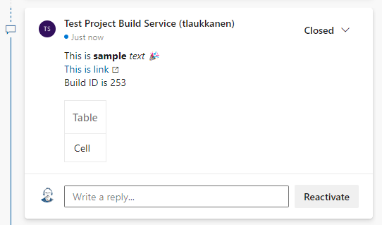
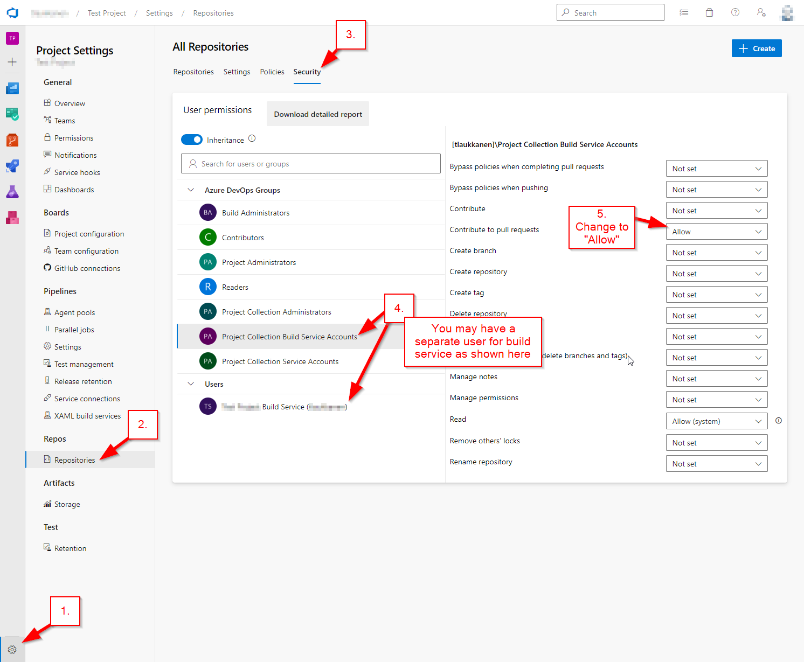

# Azure DevOps Pull Request Comment Task

Azure DevOps extension to easily add Azure Repos pull request comments from pipeline with single pipeline task. Extension is free and Open Source.

Task can be used to communicate key information from build, dev deployment etc. to the developers. For example URL of the test environment for the pull request or any other data that would be nice to have visible without a need to go to the build logs for details.

# Usage

When extension is added to your organization then you can find it from the extensions list or you can add it simply to your yaml pipeline with the following task command:

```
- task: PullRequestComment@1
  inputs:
    comment: |
      This is **sample** _text_ 🎉
      [This is link](https://microsoft.com)
      Build ID is $(Build.BuildId)
      | Table |
      |---|
      | Cell |
  displayName: 'PR Comment'
```

This example would create the following comment on the pull request:


# Installation

You can install the extension to your Azure DevOps organization from Marketplace:
[PR Comment Task](https://marketplace.visualstudio.com/items?itemName=TommiLaukkanen.pr-comment-extension)

You may need to add **Contribute to pull requests** permission to your **Project Collection Build Service Accounts** from project -> repository -> **Security**.


